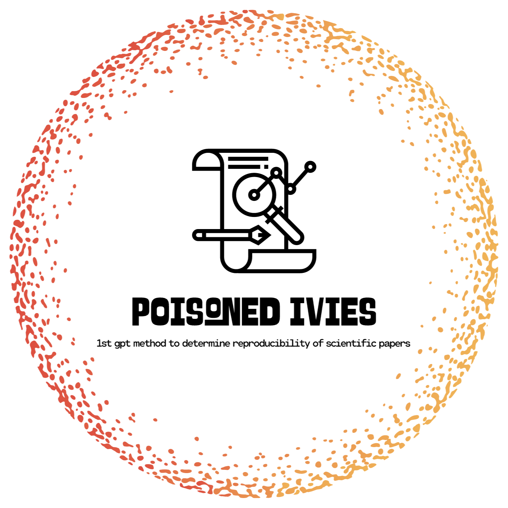

# **Poisoned Ivies: The First GPT Method to Determine Reproducibility of Princeton's Scientific Papers**

  <h1>Poisoned Ivies: The First GPT Method to Determine Reproducibility of Princeton's Scientific Papers  </h1> 

## **Inspiration**

In an era where the "**publish or perish**" mentality reigns, the issue of reproducibility in scientific research has become prominent. In 2016, a survey by Nature highlighted a jarring fact: **70%** of scientists failed to reproduce their peers' experiments. The paradox is most prominent among physicists and engineers, who seem the most confident yet are often associated with high-profile cases of irreproducibility.

These alarming statistics motivated us to delve into the issue and propose a solution. We aimed to uphold the integrity of the scientific method and realized that addressing the reproducibility crisis could also benefit businesses, particularly in the tech sector, which invests heavily in research and development.

## **What Our Project Does**

We centered our investigation on the Applied Physics department at Princeton, evaluating the work of 27 faculty principal investigators (PIs) from 2010 to 2020. We aimed to:

1. **Track citations** of the PI's papers to identify attempted reproductions and their results.
2. **Analyze the correlation** between reproducibility results and the social pressures faced by researchers.

## **How We Built It**

Our project comprises several key stages:

### **Literature Review:**

We started by reviewing relevant literature to understand the current status of irreproducibility in physics research.

### **Data Retrieval and Analysis:**

We designed a custom Python script, `main.py`, to automate the retrieval and analysis of scientific articles. The script fetches all accessible papers authored by the selected PI, stores important data, and generates a search tree based on the paper. For each paper, we generate a reproducibility score based on GPT-4 prompts.

### **Prompt Engineering:**

The prompts were carefully designed to evaluate the level of reproducibility between papers. A score ranging from -1 (clear dispute) to 1 (clear support) is assigned to each paper.

### **Visualization Enhancement:**

We enhanced our project's visualization to illustrate the network of papers clearly, making it easier for researchers to understand the relationships and credibility of the papers.

## **Challenges We Ran Into**

The major obstacles we encountered involved finding appropriate APIs for data retrieval, managing memory, and optimizing runtime. We resolved these issues by optimizing our data structures, algorithms, and reducing the layers in our tree structure to only one above and below the target nodes. Additionally, we integrated our program with the visualization code, adding and removing information to improve its intuitiveness.

## **Accomplishments We're Proud Of**

We take pride in our innovative use of prompt engineering, development of an automated AI web scraper for citations, memory management and runtime optimization, and enhancement of visualizations for an intuitive user experience.

## **What We Learned**

The project enriched our skills in prompt engineering, memory management, runtime optimization, and user experience enhancement. We also learned the importance of continuous iteration, collaboration, and ethical considerations in research.

## **What's Next**

The next steps involve extending our project beyond Princeton's papers, investigating chains of related papers, shifting focus from publication pressure to quality of research, and collaborating with tech companies to test our program on larger datasets. We also aim to market our program effectively, highlighting its potential in improving research outcomes.

---

By addressing the reproducibility crisis, our project can significantly impact both academia and industry. It provides an effective way of evaluating the credibility of scientific research, which could potentially revolutionize how research is conducted and validated.
